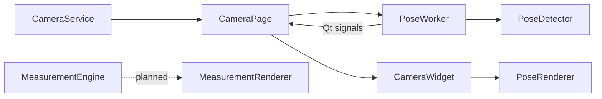

# Architecture

BodyLens uses a layered desktop architecture. Hardware access, AI inference, rendering, and UI presentation have separate responsibilities.

## Layers

| Layer | Responsibility |
| --- | --- |
| `src/services/` | Local camera access, future storage, and future export services. |
| `src/workers/` | Long-running or inference work outside the Qt GUI thread. |
| `src/ai/` | Pose detection, calibration contracts, and measurement logic. |
| `src/renderers/` | Qt painting for pose and future measurement overlays. |
| `src/models/` | Typed JSON-safe domain records. |
| `src/config/` | JSON configuration loading and saving. |
| `src/ui/` | Windows, pages, and presentation-only widgets. |
| `src/utils/` | Shared logging and constants. |

## Live camera flow

1. `CameraPage` starts `CameraService` and its frame timer.
2. It forwards a current OpenCV frame to `PoseWorker` when no inference is pending.
3. `PoseWorker` owns `PoseDetector` and runs MediaPipe on its background thread.
4. The worker emits landmarks and completion/error signals.
5. `CameraPage` forwards current landmarks to `CameraWidget`.
6. `CameraWidget` displays supplied images and delegates overlays to `PoseRenderer`.

The UI never calls MediaPipe directly. `CameraWidget` owns no camera or AI resources; it only presents frames and landmarks.

## Threading rules

- All MediaPipe inference remains in `PoseWorker`.
- The worker retains only the newest pending frame and avoids an unbounded queue.
- UI painting uses Qt primitives only; there is no `cv2.imshow()`.
- Worker shutdown is requested asynchronously so window closing does not wait on the GUI thread.

## Configuration and logging

`ConfigurationManager` loads local JSON settings for camera, AI, UI, and export defaults. `logger` is an application-wide Python logger configured by `app.py` with a console handler and daily rotating file handler.
